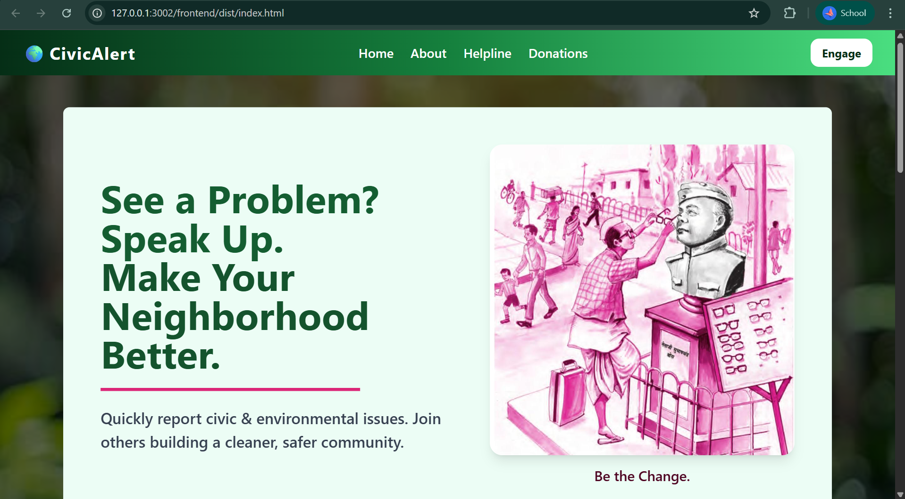
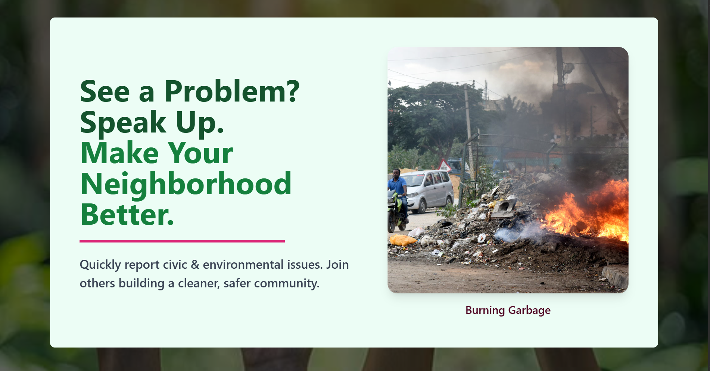
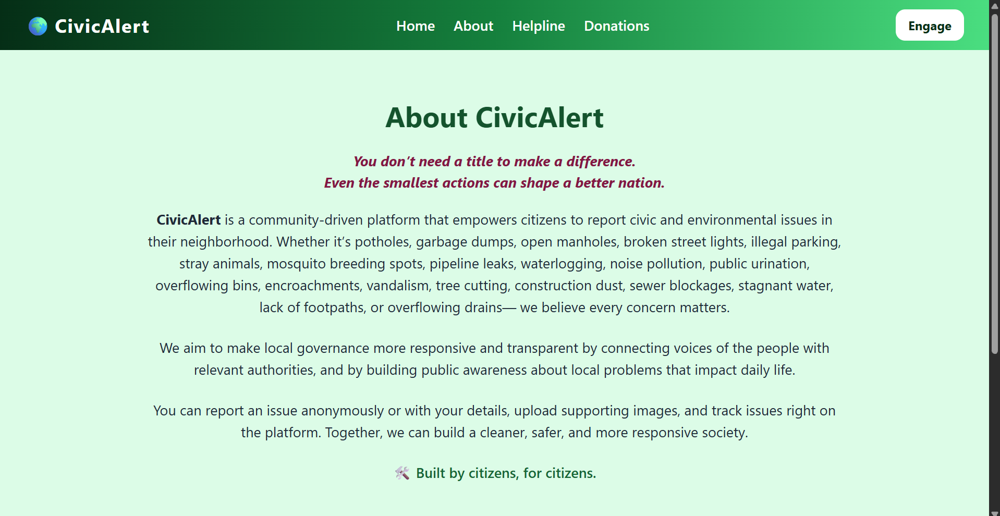
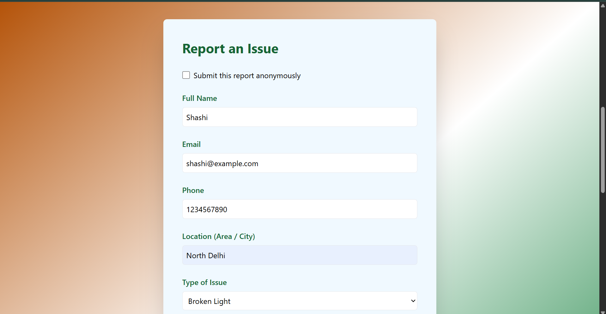
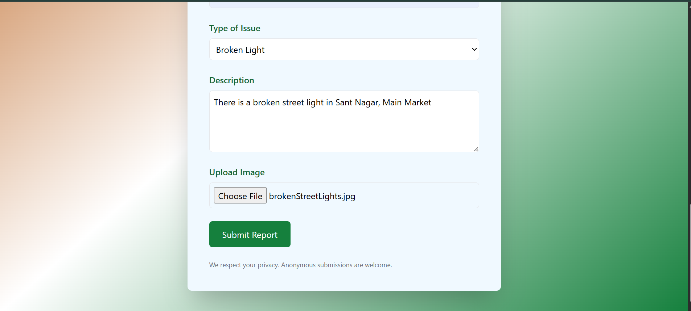
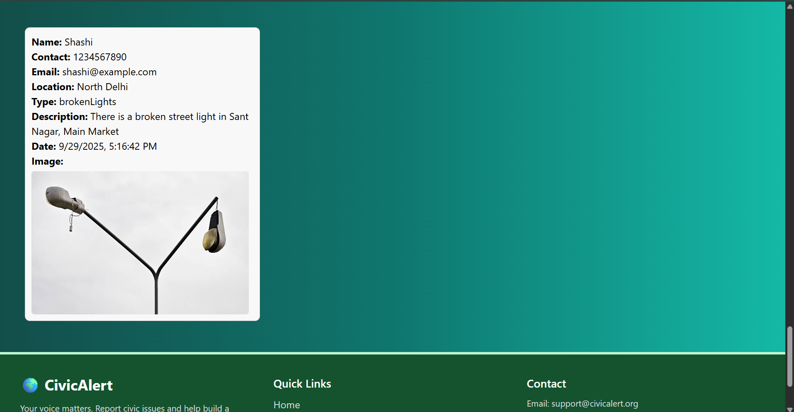
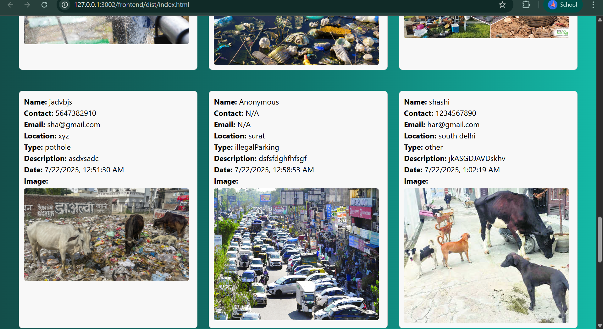
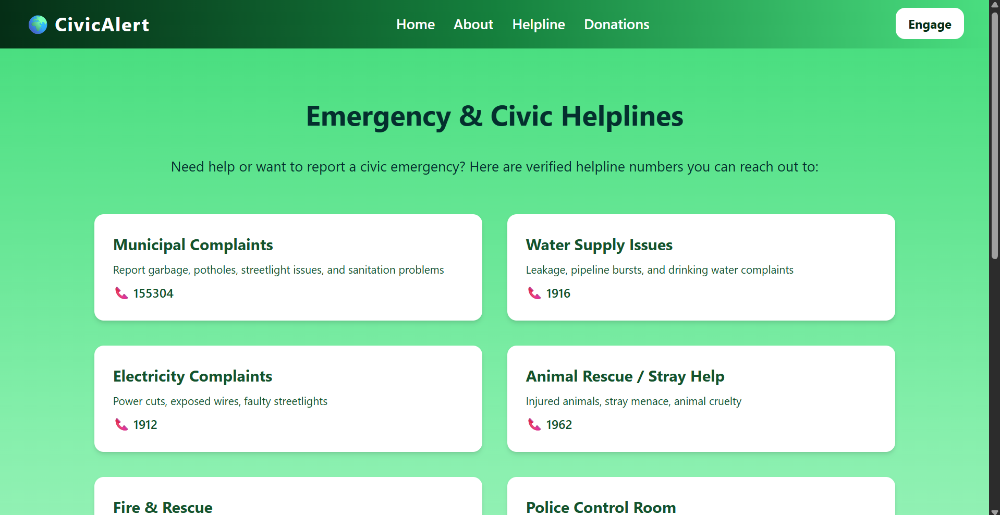
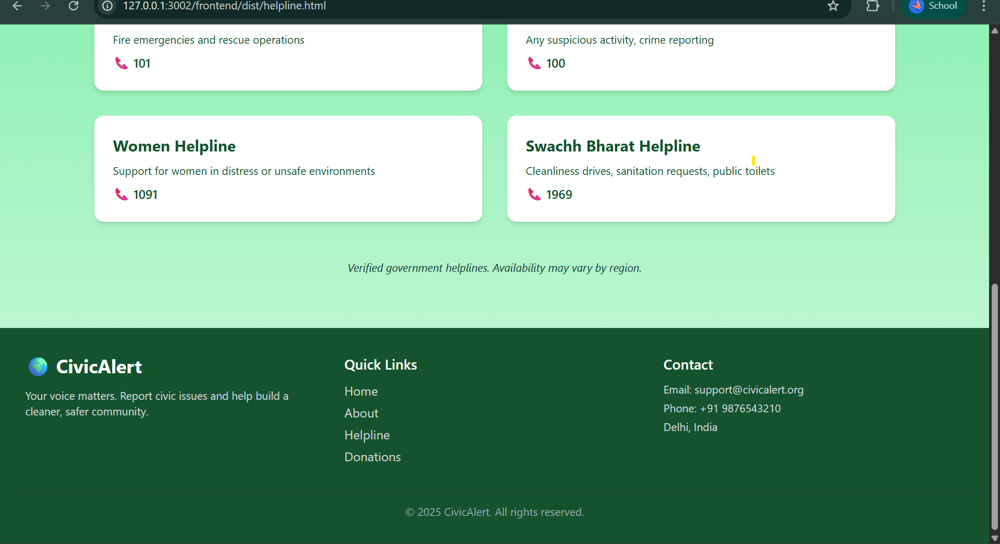
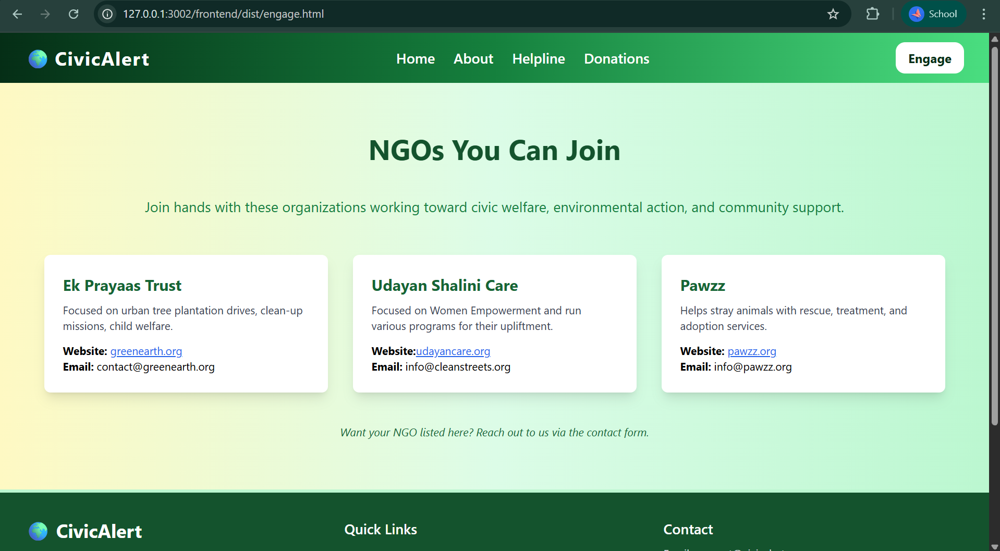

# CivicAlert 
A website where one can post social issues around them online (anonymously or with info) and the NGOs connected to the website will take suitable actions
---
## Tech Stack
### Frontend
- HTML
- TAILWIND CSS
- JS

### Backend
- Node.js
- Express
- MongoDB

### 📸 Screenshots#

### Home Page

### About Page

### Registration Page

### Issues

### Helpline

### Engage 

